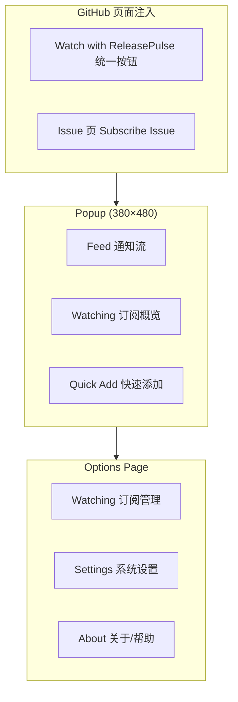

# ReleasePulse 产品设计文档

> 版本：v1.0 | 日期：2026-06-20 | 角色：产品经理视角重新设计

---

## 1. 产品定位

### 1.1 一句话定位

**ReleasePulse — 你关注的软件，一有更新就告诉你。**

### 1.2 目标用户

| 用户画像 | 核心场景 | 痛点 |
|---------|---------|------|
| **依赖追踪者** | 跟踪 React、Node 等核心依赖的版本发布 | GitHub Watch 邮件太多、Release 容易被淹没 |
| **Issue 跟进者** | 等待某个 Bug 被修复、Feature 被合并 | 需要反复打开 Issue 页面查看状态 |
| **开源爱好者** | 关注 trending 项目的新版本 | 没有轻量、专注 release 的通知工具 |

### 1.3 与现有实现的差距

当前研发实现是**功能导向**（Release / Tag / Issue 三种订阅类型并列），而非**用户任务导向**（"我想关注这个仓库"）。这导致：

- 用户在仓库首页看到两个按钮（Subscribe Releases / Subscribe Tags），决策成本高
- Options 页把「添加订阅」「订阅列表」「系统设置」混在一个长页面
- Popup 只能看通知，无法快速管理订阅
- 品牌视觉使用通用蓝色 + 铃铛图标，与 GitHub 原生 Watch 难以区分

---

## 2. 信息架构重新设计

### 2.1 核心概念模型变更

**旧模型（研发视角）**

```
Subscription = type(release|tag|issue) + owner/repo
```

**新模型（用户视角）**

```
RepoWatch = owner/repo + 事件偏好(releases, tags, issues)
IssueWatch = owner/repo#issue + 事件偏好(closed, reopened, labeled...)
```

一个仓库只需一条 **RepoWatch**，通过勾选决定关注哪些事件类型，而非创建三条独立订阅。

### 2.2 页面结构



### 2.3 Popup 三 Tab 设计

| Tab | 职责 | 设计理由 |
|-----|------|---------|
| **Feed** | 通知时间线，支持按类型筛选 | 用户点击插件图标的首要意图是「看有没有新消息」 |
| **Watching** | 按仓库分组展示订阅，可快速开关 | 减少跳转 Options 的频率，提高管理效率 |
| **Add** | 输入 URL 或 owner/repo 快速添加 | 保留手动添加入口，但不再占用 Options 首屏 |

### 2.4 Options 侧边栏导航

| 页面 | 内容 |
|------|------|
| **Watching** | 完整订阅 CRUD、按仓库分组、批量操作 |
| **Settings** | GitHub Token、轮询间隔、通知开关、API 配额状态 |
| **About** | 版本信息、使用帮助、反馈链接 |

**设计理由**：Settings 中的 Token 配置对重度用户至关重要，当前被放在页面最底部，首次配置体验差。独立 Settings 页 + 首次引导强制配置 Token 可显著降低 API 限流导致的静默失败。

---

## 3. 交互流程重新设计

### 3.1 首次使用（Onboarding）

**现状问题**：Popup 和 Options 各有一套 Welcome 引导，内容重复。

**新流程**：

1. 安装后首次打开 Popup → 全屏引导（3 步），仅出现一次
2. 引导结束前不展示 Feed 空状态
3. Step 3 引导配置 GitHub Token（可跳过，但展示限流风险提示）
4. Options 页不再重复 Welcome Banner

### 3.2 GitHub 页面订阅

**现状**：仓库首页注入两个按钮 `Subscribe Releases` + `Subscribe Tags`

**新设计**：

- 仓库页/Release 页/Tags 页：统一一个按钮 **「Watch with ReleasePulse」**
- 点击后弹出小面板（Popover），勾选关注项：
  - ☑ New Releases
  - ☐ New Tags
  - ☐ Issues（跳转到 Issue 列表说明）
- Issue 页：保留 **「Subscribe Issue」**，因为粒度不同

**设计理由**：用户心智是「关注这个仓库」，不是「选择 API 订阅类型」。Popover 让用户一次完成配置，减少误操作。

### 3.3 通知 Feed

**增强项**：

| 功能 | 优先级 | 理由 |
|------|--------|------|
| 按类型筛选（All / Release / Tag / Issue） | P1 | 通知多时快速定位 |
| 未读/已读视觉区分 | 已有 | 保持左侧色条 + 加粗标题 |
| 点击通知 → 打开链接 + 标记已读 | 已有 | — |
| 通知分组（Today / Yesterday / Earlier） | P2 | 时间线更清晰 |
| 单条删除 / 归档 | P3 | 低优先级 |

### 3.4 系统状态可见性

**新增 Status Bar**（Popup 底部或 Settings 顶部）：

```
● Synced 5m ago · 12 watches · API: 847/5000 remaining
```

**设计理由**：轮询型插件最大信任危机是「它还在工作吗？」。展示上次同步时间和 API 配额可建立用户信心。

---

## 4. 视觉设计系统

### 4.1 品牌色彩

| Token | 色值 | 用途 | 变更理由 |
|-------|------|------|---------|
| `--primary` | `#4338CA` (Indigo 700) | 主按钮、Tab 激活态 | 区别于 GitHub 绿和通用 Tailwind 蓝 |
| `--accent` | `#FF6B4A` (Coral) | Logo 渐变、强调、Pulse 动画 | 传达「脉冲/活跃」品牌语义 |
| `--release` | `#16A34A` | Release 徽章 | 保持绿色语义（发布=就绪） |
| `--tag` | `#9333EA` | Tag 徽章 | 保持紫色区分 |
| `--issue` | `#EA580C` | Issue 徽章 | 保持橙色区分 |
| `--background` | `#FAFAFA` | 页面背景 | 对齐 shadcn 设计规范 |
| `--card` | `#FFFFFF` | 卡片 | — |
| `--border` | `#E4E4E7` | 边框 | — |
| `--muted` | `#71717A` | 次要文本 | — |

### 4.2 字体

- 英文：`Inter`
- 中文：`Noto Sans SC`
- 插件 Popup 以 14px Body 为主，标题 16–18px

### 4.3 圆角与间距

- 按钮/输入框：8px
- 卡片：12px
- 间距遵循 4px 网格（8 / 12 / 16 / 24）

### 4.4 图标策略

- **放弃通用 Bell 作为主标识** — 与系统通知图标混淆
- **采用 Pulse Wave + Release Arrow 组合** — 见 Logo 设计
- 功能图标继续使用 Lucide（与 React 代码一致）

---

## 5. LOGO 设计

### 5.1 设计概念

**图形语义**：ECG 脉冲波形 → 向右上升为 Release 箭头

- **Pulse（脉冲）**：表达持续监控、心跳检测
- **Arrow（箭头）**：表达新版本发布、向上更新
- **渐变**：Indigo → Coral，科技感和活力并存

### 5.2 应用场景

| 场景 | 规格 | 要求 |
|------|------|------|
| 浏览器工具栏 | 16×16 | 仅保留波形+箭头核心，无渐变细节 |
| 插件管理页 | 48×48 | 完整渐变背景 |
| 商店/文档 | 128×128 | 完整设计 |

### 5.3 设计稿

见 `doc/design/releasepulse-logo.png`

### 5.4 与现有图标对比

| | 现有 | 新设计 |
|---|------|--------|
| 图形 | 蓝色圆角方块 + 白色铃铛 | 渐变方块 + 脉冲箭头 |
| 语义 | 通用通知 | 监控 + 发布 |
| 辨识度 | 低（像系统通知） | 高（独特品牌） |

---

## 6. UI 设计稿

> Pencil MCP 当前环境不可用，以下为高保真示意稿（AI 生成），研发实现时参考布局与层级。

### 6.1 Popup — Feed Tab

见 `doc/design/releasepulse-popup-mockup.png`

**关键布局**：
- 顶栏：Logo + 标题 + 未读 Badge + 操作图标
- Tab 栏：Feed | Watching | Add
- 通知卡片：类型 Badge + 仓库名 + 标题 + 相对时间
- 底栏：Mark all read / Clear all

### 6.2 Options — Watching 页

见 `doc/design/releasepulse-options-mockup.png`

**关键布局**：
- 左侧 Sidebar：Watching / Settings / About
- 主区域：按仓库分组的 Watch 卡片
- 每张卡片内：事件类型 Checkbox + 最后检查时间 + 开关 + 删除

---

## 7. 数据模型调整建议

### 7.1 新增 RepoWatch（替代多条同仓库订阅）

```typescript
interface RepoWatch {
  id: string
  owner: string
  repo: string
  label: string
  events: {
    releases: boolean
    tags: boolean
  }
  lastCheckedAt: string | null
  lastSeenReleaseId: string | null
  lastSeenTagSha: string | null
  enabled: boolean
  createdAt: string
}
```

### 7.2 IssueWatch 保持独立

Issue 订阅粒度是单个 Issue，不适合合并进 RepoWatch。

### 7.3 Settings 扩展

```typescript
interface Settings {
  githubToken: string
  pollIntervalMinutes: number
  desktopNotifications: boolean
  onboardingCompleted: boolean  // 新增
  lastSyncAt: string | null     // 新增
  apiRemaining: number | null   // 新增
}
```

---

## 8. 优先级路线图

### Phase 1 — 体验修复（1–2 周）

- [ ] 统一 Onboarding（仅 Popup 一次）
- [ ] Popup 增加 Watching Tab（只读概览）
- [ ] GitHub 注入按钮合并为 Watch + Popover
- [ ] 替换 Logo 和 brand 色板
- [ ] Settings 页独立 + API 状态展示

### Phase 2 — 模型优化（2–3 周）

- [x] RepoWatch 数据模型迁移
- [x] 订阅按仓库分组展示
- [x] Feed 类型筛选
- [x] 通知时间分组

### Phase 3 — 扩展（未来）

- [ ] GitLab / Bitbucket 订阅源
- [ ] 预发布过滤（仅 stable release）
- [ ] 订阅导入/导出
- [x] Firefox 支持

---

## 9. 设计决策摘要

| 决策 | 选择 | 理由 |
|------|------|------|
| 订阅模型 | 仓库级 Watch + 事件勾选 | 降低认知负担，符合用户心智 |
| Popup 结构 | 三 Tab | 一个入口完成看、管、加 |
| Options 结构 | 侧边栏导航 | 设置不再被埋没 |
| 主色 | Indigo + Coral | 差异化品牌，传达 Pulse 语义 |
| Logo | 脉冲→箭头 | 功能可视化，非通用铃铛 |
| GitHub 按钮 | 单一 Watch 入口 | 减少决策点，Popover 配置细节 |

---

## 10. 附录：现有实现审计清单

| 模块 | 现状评价 | 建议 |
|------|---------|------|
| Background 轮询 | ✅ 架构合理 | 增加 sync 状态写入 Settings |
| Content Script 注入 | ⚠️ 双按钮混乱 | 合并为 Watch + Popover |
| Popup | ⚠️ 功能单一 | 三 Tab 扩展 |
| Options | ⚠️ 信息过载 | 侧边栏拆分 |
| 品牌 | ❌ 无辨识度 | 新 Logo + 色板 |
| 类型系统 | ⚠️ 研发导向 | 迁移到 RepoWatch |
